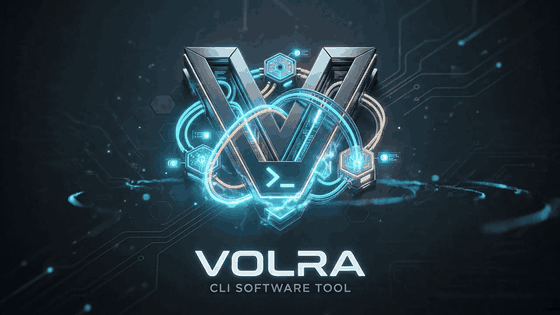

<div align="center">
  

  <h3>Own your agent infrastructure.</h3>
  <p>Deploy and monitor AI agents on your own servers.<br>CLI-first · Framework-agnostic · Open-source</p>

  <p>
    <a href="#quick-start">Quick Start</a> ·
    <a href="#templates">Templates</a> ·
    <a href="docs/mcp-integration.md">MCP</a> ·
    <a href="#contributing">Contributing</a>
  </p>

  <p>
    <a href="https://github.com/romerox3/volra/actions/workflows/ci.yml"></a>
    <a href="https://github.com/romerox3/volra/releases"></a>
    <a href="LICENSE"></a>
  </p>
</div>

---

```
$ volra deploy

  Volra Deploy v1.2.0

  Generating artifacts...
    ✓ Dockerfile                → .volra/Dockerfile
    ✓ docker-compose.yml        → .volra/docker-compose.yml
    ✓ prometheus.yml            → .volra/prometheus.yml
    ✓ alert_rules.yml           → .volra/alert_rules.yml
    ✓ grafana dashboards        → .volra/grafana/
    ✓ agent-card.json           → .volra/agent-card.json

  Starting services...
    ✓ my-agent       (port 8000)    healthy
    ✓ prometheus     (port 9090)    running
    ✓ grafana        (port 3001)    running
    ✓ alertmanager   (port 9093)    running

  ✅ Deploy complete (34s)

  Your agent:     http://localhost:8000
  Dashboard:      http://localhost:3001
  Agent Card:     http://localhost:8000/.well-known/agent-card.json
```

## Quick Start

### Install

```bash
curl -fsSL https://raw.githubusercontent.com/romerox3/volra/main/install.sh | sh
```

<details>
<summary>Other install methods</summary>

```bash
# Homebrew
brew install romerox3/volra/volra

# From source
git clone https://github.com/romerox3/volra.git
cd volra && make build
./bin/volra --version
```
</details>

### Deploy your agent

```bash
cd my-agent/          # Your Python agent directory
volra doctor           # Check prerequisites
volra init .           # Auto-detect agent, generate Agentfile
volra deploy           # Generate stack + deploy with monitoring
```

Open `http://localhost:3001` — your agent is monitored.

> [!TIP]
> Start from a template instead: `volra quickstart` opens an interactive TUI to browse templates, or use `volra quickstart basic my-agent` for direct scaffolding.

## Templates

24 built-in templates across 4 categories:

| Template | Category | Services | Description |
|----------|----------|----------|-------------|
| `basic` | Getting Started | — | Minimal FastAPI agent with health + ask endpoints |
| `rag` | Use Cases | Redis, ChromaDB | RAG agent with semantic search and vector DB |
| `conversational` | Use Cases | Redis, PostgreSQL | Conversational agent with session memory and SSE streaming |
| `api-agent` | Use Cases | — | Function-calling agent using raw tool-calling (no framework) |
| `mcp-server` | Use Cases | — | MCP-compatible tool server for Claude Desktop, Cursor, etc. |
| `langgraph` | Frameworks | — | LangGraph ReAct agent with tool-calling and thread memory |
| `crewai` | Frameworks | — | CrewAI multi-agent crew with Researcher and Writer agents |
| `openai-agents` | Frameworks | — | OpenAI Agents SDK with tools, handoffs, and specialization |
| `smolagents` | Frameworks | — | HuggingFace code agent that writes and executes Python |
| `discord-bot` | Platforms | Redis | AI-powered Discord bot with slash commands and rate limiting |
| `slack-bot` | Platforms | — | Slack bot with Socket Mode and @mention responses |
| `web-chat` | Platforms | — | Full-stack chat UI with WebSocket and dark theme |

```bash
volra quickstart                       # Interactive TUI — browse, filter, select
volra quickstart langgraph my-agent    # Direct — scaffold immediately
volra quickstart --json                # List templates as JSON
NO_COLOR=1 volra quickstart            # Simple numbered list fallback
```

## Features

- **Self-hosted, zero vendor lock-in** — Your servers, your data. No cloud accounts, no billing surprises. Deploy on any machine with Docker.

- **Any Python framework** — LangGraph, CrewAI, OpenAI Agents, smolagents, or no framework at all. Volra deploys agents, not opinions.

- **Observable by default** — Every deploy includes Prometheus + Grafana + Alertmanager with health probes, uptime tracking, latency metrics, and alerting rules.

- **LLM observability** — Level 2 adds token usage, cost tracking, and latency percentiles via [`volra-observe`](volra-observe/), a drop-in Python package that instruments OpenAI and Anthropic SDKs.

- **Control plane & console** — `volra server` provides REST API, SQLite persistence, and a built-in web console to manage all agents from one dashboard.

- **Docker & Kubernetes** — Deploy to Docker Compose or Kubernetes with `--target k8s`. Auto-generated manifests with health probes and ServiceMonitors.

- **RBAC & API keys** — Role-based access with admin, operator, and viewer roles. Bcrypt-hashed API keys with Bearer token authentication.

- **Federation & Agent Mesh** — Connect multiple Volra instances. A2A v0.3 agent cards, cross-server tool routing via MCP gateway, unified agent catalog.

- **Infrastructure as config** — Declare Redis, PostgreSQL, ChromaDB as services in your Agentfile. Volra generates the full Docker Compose stack.

- **Security defaults** — Read-only filesystem, dropped capabilities, per-service env isolation, auto-tmpfs. Secure without thinking about it.

- **Editor integration** — [MCP server](docs/mcp-integration.md) exposes deploy, status, logs, and doctor as tools for Cursor, VS Code, and Claude Code.

## What Volra Generates

Everything is human-readable, editable, and disposable:

```
my-agent/
├── main.py              # Your code (unchanged)
├── requirements.txt     # Your deps (pip, poetry, uv, or pipenv)
├── Agentfile            # Agent config (generated by init, you customize)
├── .env                 # Your secrets (gitignored)
└── .volra/              # Generated stack (gitignored, regenerated on each deploy)
    ├── Dockerfile
    ├── docker-compose.yml
    ├── prometheus.yml
    ├── alert_rules.yml
    ├── blackbox.yml
    └── grafana/
```

`.volra/` is fully regenerated on each deploy. Your Agentfile is the single source of truth.

## Agentfile

Declarative YAML — auto-generated by `volra init`, customizable by you:

```yaml
version: 1
name: my-agent
framework: langgraph        # generic | langgraph
port: 8000
health_path: /health
package_manager: poetry     # pip | poetry | uv | pipenv (auto-detected)
dockerfile: auto            # auto | custom
env:
  - OPENAI_API_KEY

services:
  redis:
    image: redis:7-alpine
    port: 6379
  postgres:
    image: postgres:16-alpine
    port: 5432
    volumes:
      - /var/lib/postgresql/data
    env:
      - POSTGRES_PASSWORD

security:
  read_only: true
  no_new_privileges: true
  drop_capabilities:
    - NET_RAW

observability:
  level: 2              # 1 = probe only, 2 = LLM metrics (via volra-observe)
  metrics_port: 9101

build:
  setup_commands:
    - "python -m nltk.downloader punkt"
  cache_dirs:
    - /root/nltk_data
```

## Commands

| Command | What it does |
|---------|-------------|
| `volra doctor` | Pre-flight check: Docker, Compose, ports, Python |
| `volra init .` | Scan project, detect framework, generate Agentfile |
| `volra deploy` | Generate stack + deploy + verify health (`--target docker/k8s`, `--dry-run`) |
| `volra status` | Check health of deployed agent |
| `volra logs` | Stream logs from deployed agent |
| `volra quickstart` | Create new agent from 24 built-in templates |
| `volra dev` | Hot-reload development mode (Docker Compose watch) |
| `volra down` | Stop all deployed services |
| `volra update` | Self-update to latest release |
| `volra eval` | Record baselines and detect regressions |
| `volra hub` | Unified multi-agent Grafana dashboard |
| `volra gateway` | MCP gateway with cross-agent tool routing |
| `volra server` | Control plane with REST API and web console |
| `volra auth` | Manage API keys (admin/operator/viewer RBAC) |
| `volra federation` | Connect multiple Volra servers |
| `volra agents` | List all agents across the mesh with capabilities |
| `volra audit` | View deployment audit trail |
| `volra marketplace` | Discover and install community templates |
| `volra compliance` | Generate EU AI Act documentation |
| `volra mcp` | Start [MCP server](docs/mcp-integration.md) for editor integration |

All commands support `--json` for CI/CD integration.

## Why Self-Hosted?

**Data sovereignty** — LLM requests, user data, and agent state stay on infrastructure you control. No third-party processing.

**Compliance** — Meet regulatory requirements (GDPR, HIPAA, internal policies) without trusting a vendor's compliance posture.

**Cost predictability** — Fixed infrastructure costs instead of per-request pricing. Run as many agents as your hardware supports.

**Full control** — Standard Docker Compose under the hood. You can read, edit, and understand every generated file. No black boxes.

> [!NOTE]
> Volra is not a cloud platform — it's a CLI that generates production infrastructure on your machine. No accounts, no billing, no vendor lock-in. Use any framework, deploy anywhere Docker runs.

## Roadmap

| Version | Focus | Status |
|---------|-------|--------|
| v0.1 | Deploy + monitor (doctor, init, deploy, status) | Released |
| v0.2 | Templates, logs, Level 2 observability, MCP server, --json | Released |
| v0.3 | Interactive TUI quickstart (Bubbletea) | Released |
| v0.4 | Developer loop: `volra dev`, `volra down`, Homebrew, self-update | Released |
| v0.5 | Observability & Evaluation: `volra eval`, agent hub, CrewAI | Released |
| v0.6 | MCP Gateway, OTel auto-instrumentation, Langfuse, A2A cards | Released |
| v0.7 | Governance: Alertmanager, marketplace, audit, compliance | Released |
| v1.0 | Production Platform: control plane, console, K8s, RBAC, federation | Released |
| v1.1 | Agent Mesh: A2A v0.3, federated discovery, cross-server routing | Released |
| v1.2 | Smart Sidecar: Go A2A proxy, task execution, gateway A2A routing | **Current** |

## Requirements

- Docker with Compose V2
- Python 3.10+ (for your agent)
- macOS ARM64, Linux AMD64/ARM64

## Contributing

Contributions welcome. Please open an issue before submitting a PR for non-trivial changes.

<details>
<summary>Build from source</summary>

```bash
git clone https://github.com/romerox3/volra.git
cd volra
make build
./bin/volra --version
```
</details>

```bash
make test          # Unit tests (no Docker)
make e2e           # E2E Phase 1+2 (no Docker)
make e2e-deploy    # E2E Phase 3+4 (Docker required)
```

## License

[MIT](LICENSE) © 2026 [Antonio Romero](https://github.com/romerox3)
